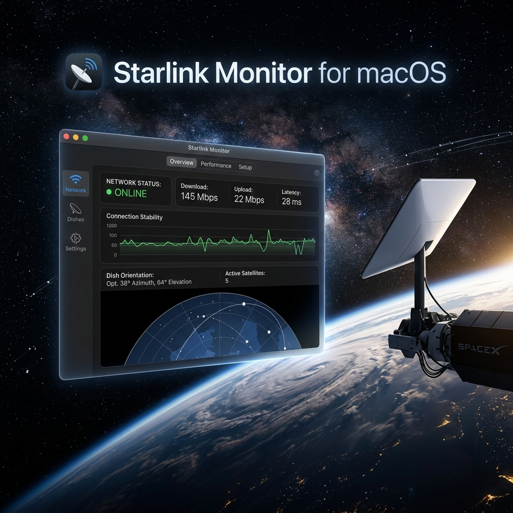

# Starlink Monitor for macOS



A native, high-performance macOS application designed to give you deep, direct insights into your Starlink satellite dish—without ever needing to reach for your mobile phone.

## Why This Exists

Historically, monitoring a Starlink connection required using the official iOS or Android mobile applications. While these apps are great, desktop users—especially power users, developers, and those using Starlink as a primary WAN failover—needed a way to monitor their dish natively from their workstations.

This project was built to provide a **native macOS experience** that interfaces directly with the local gRPC endpoint exposed by your Starlink dish. By connecting directly to `192.168.100.1` (the default dish IP), this app bypasses cloud relays and provides instant, raw telemetry with zero latency.

## Key Features

- **Native SwiftUI Performance**: Built completely in Swift and SwiftUI, ensuring maximum efficiency, smooth animations, and a tiny memory footprint.
- **Direct gRPC Multiplexing**: Connects directly to the Starlink dish using the `grpc-swift-nio-transport` library. Maintains a single, persistent HTTP/2 connection to avoid connection limits and memory leaks on the dish's internal processor.
- **3D Sky View**: Leverages Apple's SceneKit to procedurally generate an interactive 3D dome representing the signal-to-noise (SNR) obstruction map from your dish. Click, drag, and pinch to visualize exactly where trees or buildings are blocking your connection.
- **Granular Telemetry**: Monitor ping drop rates, latency, uptime, and active connected clients in real-time.
- **Hardware Controls**: Send direct commands to stow or unstow the dish.
- **Automatic Updates**: Powered by Sparkle 2, the app will automatically keep itself up to date via GitHub Releases.

## Architecture & Code Philosophy

This project was developed strictly following clean, modular architecture principles:
- **Stateless Services**: Network communication is abstracted into a decoupled `StarlinkService`.
- **Reactive State**: The UI is driven by an `@ObservedObject` `TelemetryMonitor`, which acts as the single source of truth.
- **Generated Protobufs**: All gRPC client code is generated directly from the official Starlink protobuf definitions (vendored in `starlink-grpc-tools`) to ensure type safety and protocol compatibility.
- **Granular History**: The Git history is meticulously maintained with atomic commits that explain *why* choices were made, acting as a living documentation of the architecture.

## Installation & Updates

Since this app integrates **Sparkle**, you do not need to download new DMG files manually. 

1. Download the latest `StarlinkMonitor.dmg` from the **[Releases](../../releases)** page.
2. Drag the app into your `/Applications` folder.
3. Upon opening, the app will automatically check this GitHub repository for new updates and install them seamlessly.

## Building from Source

To build this project locally, you will need:
- Xcode 16+
- macOS 15.0+
- [XcodeGen](https://github.com/yonaskolb/XcodeGen)

1. Clone the repository:
   ```bash
   git clone https://github.com/RoRoRangler/StarlinkMonitor.git
   cd StarlinkMonitor
   ```
2. Generate the Xcode project:
   ```bash
   xcodegen
   ```
3. Open `StarlinkMonitor.xcodeproj` in Xcode and hit **Run**, or build from the command line:
   ```bash
   xcodebuild -scheme StarlinkMonitor build
   ```

## Contributing

Contributions are welcome! Please ensure any pull requests follow the existing "atomic commit" philosophy: small, logical commits with highly descriptive, present-tense messages explaining the intent behind the changes.
